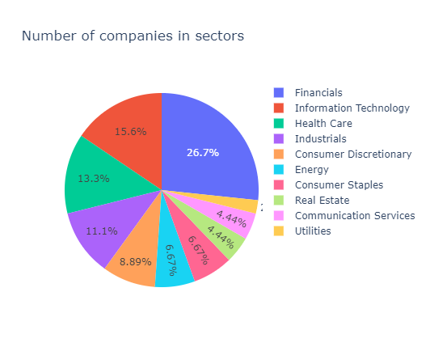

# Financna matematika projekt

# Pripravna faza

## Hodnotenie portfolia FMFI

Obdobie za ktore vyhodnocujeme data: 1.1.2021 az 1.11.2021
pocet pracovnych dni v roku aproximujeme na: 252

Mame prekonat portfolio fmfi
po analyze sme ziskali hodnoty
**Rocny vynos: 5.85%** 
**Rocna volatilita: 18.91%**

### Vyberanie aktiv

Rozhodli sme sa vyberat z akcii na indexe S&P 100
pouzili sme zoznam z  22. marca 2021
nebolo mozne stiahnut data z akcii BRK.B, HD

Zoznam akcii ktore chceme pouzit: 'GOOG', 'SPG', 'GOOGL', 'MSFT', 'GD', 'ACN', 'COP', 'F', 'BAC', 'GS',
       'NVDA', 'AIG', 'MS', 'WFC', 'ORCL', 'XOM', 'TGT', 'LOW', 'EXC', 'COST',
       'AXP', 'BK', 'JPM', 'COF', 'CSCO', 'DHR', 'UNH', 'CVS', 'LLY', 'CVX',
       'MET', 'AMT', 'CRM', 'BLK', 'RTX', 'MCD', 'TMO', 'LIN', 'ADBE', 'EMR',
       'USB', 'UPS', 'TSLA', 'PFE', 'PM'

Rozdelenie vybratych aktiv podla sektorov:

Kedze ziadny sektor nieje priliz dominantny tak sme boli spokojny s vyberom aktiv

### Rozdelenie aktiv: Markowitz

Na tvorbu prveho portfolia sme pouzili markowitzov problem avsak formulovany ako minimalizacia Sharpe ratio
* kapital nam rozdelilo iba do 17 akcii
* preto sme zmenili ohranicenia vah na interval od 0.01 do 1
* **Rocny vynos: 55.37%**
* **Rocna volatilila: 12.49%** 

Vyskusali sme pridat ohranicenie ze do 17 akcii ktore si najprv "vybral" model moze ist max 80% kapitalu, avsak pocet pouzitych akcii sa znizil 

**TODO**
* plotovat rozdelenie vah na sektory
* ak by sme neboli spokojny vytvorit ohranicenia na sektory (vyskusat aj pre vahy z intervalu 0,1)
* otestovat portfolio na novych datach

### Rozdelenie aktiv: Geneticky algoritmus:

Na tvorbu drueho portfolia chceme pouzit umelu intelgenciu. Konkretne genetiky algoritmus.

* Jedinec: vektor vah pre nejake portfolio
* Populacia: 100
* Pocitanie fitness: este nevieme
* k v k-point-crossover: este nevieme
* sanca pre mutaciu: este nevieme

Kedze musi platit ze &sum;wi = 1 tak po kazdej iteracii musime celu populaciu **normalizovat** .
