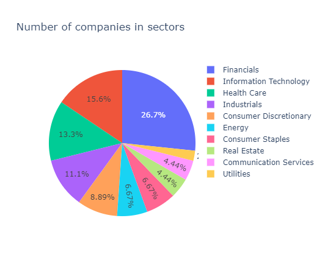

# Financna matematika projekt

# Pripravna faza

## Hodnotenie portfolia FMFI

Obdobie za ktore vyhodnocujeme data: 1.1.2021 az 1.11.2021
pocet pracovnych dni v roku aproximujeme na: 252

Mame prekonat portfolio fmfi
po analyze sme ziskali hodnoty
**Rocny vynos: 5.85%** 
**Rocna volatilita: 18.91%**

### Vyberanie aktiv

Rozhodli sme sa vyberat z akcii na indexe S&P 100
pouzili sme zoznam z  22. marca 2021
nebolo mozne stiahnut data z akcii BRK.B, HD

Zoznam akcii ktore chceme pouzit: 'GOOG', 'SPG', 'GOOGL', 'MSFT', 'GD', 'ACN', 'COP', 'F', 'BAC', 'GS',
       'NVDA', 'AIG', 'MS', 'WFC', 'ORCL', 'XOM', 'TGT', 'LOW', 'EXC', 'COST',
       'AXP', 'BK', 'JPM', 'COF', 'CSCO', 'DHR', 'UNH', 'CVS', 'LLY', 'CVX',
       'MET', 'AMT', 'CRM', 'BLK', 'RTX', 'MCD', 'TMO', 'LIN', 'ADBE', 'EMR',
       'USB', 'UPS', 'TSLA', 'PFE', 'PM'

Rozdelenie vybratych aktiv podla sektorov:

Kedze ziadny sektor nieje priliz dominantny tak sme boli spokojny s vyberom aktiv
